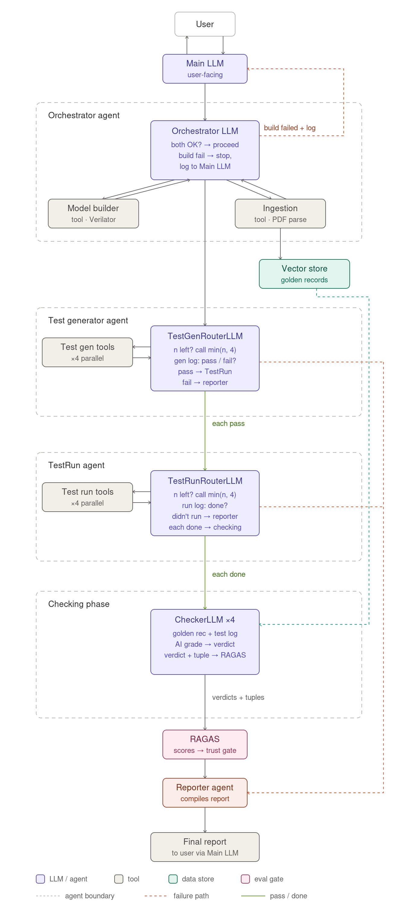

📝 Task 1: Articulate the problem and the user of your application

Description of the problem:- 
Testbench checker development time for testing complicated chip design blocks can delay chip testing process making the project slip and risking losing the customer! 

Why the checkers are a problem?
In the chip design industry that I have worked at for over a decade, I have noticed many times that the test engineer has to design a humongous checker 
and that is used to verify the chip design that is new. New HUMONGOUS Checker on a New Design is a recipe for disaster at times when the design is too complicated as both the CHECKER and DESIGNER have lots of bugs that need to be resoved at the same time. You can't test a design when the testbench itself is having a lot of issues. The project completion gets pushed out like crazy. The project loses customer or the customer gets ferocious and the test engineers have to face the wrath of irate customers :()

WORKFLOW DIAGRAM CURRENTLY

   DESIGN FLOW              SPEC ->  DESIGN START CHIP DESIGN -> BUGS FILED -> ABSORB THE BUGS -> SIMULATE -> MORE BUGS -> FIX ->>>>

   VERIFICATION FLOW        SPEC -> DESIGN TESTBENCH -> DESING CHECKERS -> FIND BUGS IN DESIGN + T/B CHECKERS -> FIX T/B CHECKERS -> SIMULATE -> FIND BUGS IN DESIGN AND CHECKERS -> FIX TB CHECKERS -> SIMULATE ->>>>

INPUT OUTPUT PAIRS TO EVAL APPS CURRENTLY :-   UVM CHECKERS/MONITORS/RANDOM TESTS/DIRECTED TEST (testbench collateral) 
                                               TEST CONTAINS STIMULUS, MONITORS CONTAIN EXPECTED beHAVIOR OF DESIGN, CHECKERS check expected vs actual beahvior! 

----------------xxxxxxxxxxxxxxxxxxxxxxxxx----------------------------------xxxxxxxxxxxxxxxxxxxxxxxxxxxxxxxxxxxxxxx----------------------------------

Task 2: Propose a Solution

Describe your solution in one sentence.

In this current prototype that I have built, I have gotten rid of the checker totally! 
The checker is now an Intelligent checker. 
I have created a RULE FILE (manually created --fast) which is what the Intelligent checker uses to calcualte the expected behavior of the chip design adn then compares it to the LOG files of the test (Actual behavior of the design).
The agent I created generated a test or multiple tests after retrieving those test from the RAG , then runs those tests while collecting the logs,  Then the logs are given to teh checker which retrieves the correct RULES From the rag and checks the test. 
This was a big expriement and the checker has the intelligence to compare expected and actual beahvior adn conclude correctly if the test passes or fails! 
When I last checked no one has an Intelligent checker now! 

Create an infrastructure diagram showing the technologies that make up your system. Write one sentence explaining why you chose each component. "What technologies make up your system?”
LLM(s)
Agent orchestration framework  THIS IS A BIG ONE, BUT PASTING IT BELOW.

Tool(s)          Docling (chunking),  Qdrant - store , BM25 + dense retrieval -> RRF -> final output 
Embedding model  chatgpt-5.4 mini, gpt-5.6 mini, gpt-5.6 tera
Vector Database  Qdrant
Monitoring tool        langsmith
Evaluation framework   RAGAS
User interface         vercel
Deployment tool        vercel
Any other components you need

Create an Agent Workflow Diagram illustrating how your application solves the user's problem from end to end. Accompany the diagram with 1–2 paragraphs explaining the workflow.

    TEST FLOW : CREATE RULE FILE AT START OF PROJECT (golden) -> RUN TEST -> CHECKER -> FILE DESIGN BUGS (NO CHECKER BUGS)
    You dont have the iterations of creating checkers and then verifying it over and over again.

"How does the application solve the user's problem?” The verification engineers don't have to waste time coding the checker and then fimnding bugs in there. THe design can be tested right on day0!!!

Your workflow should include:  My agent with the intelligent checker! 

The user's input:  FEATURE TO TEST. 
The agent's reasoning and decision points: Agent builds the design model, stores test plan and RULES into RAG, retrieve the test from RAG and generate it, run the test and collect the logs, checker retreives the RULE files from the RAG and compares with log file of test run and comes with VERDICT PASS/FAIL, then RAGAS judges the retrievals and the TEST VERDICT of the checker. Finally the report prints the report of the passed/failed tests.

What tools the agent calls and why: Agent calls agents as tools, it can call tools to generate tests/ run tests/ build design models/ call RAGAS To do evals on retreival and test checker output

The final output returned to the user: REPORT of the pass/fail! 

Any human review or approval steps:  CREATE THE TEST PLAN , RULE FILES and that has to be fed to the RAG.
Requirements:

-----------------------xxxxxxxxxxxxxxxxxxxxxxxxxxxxx----------------------------------xxxxxxxxxxxxxxxxxxxxxxxxxxxxxx-----------------------------------------

Task 3: Dealing with the Data
You are an AI Systems Engineer. The AI Solutions Engineer has handed off the plan to you. At a minimum, you’ll need to implement a simple Agentic RAG solution that includes two aspects:

Your own personal data, uploaded to your application (e.g., RAG):
 I have my own data in the docs folder (Test plan and rule file)

The ability to search publicly available data (e.g., a simple agentic search tool like Tavily) : 
Dont need this for the project.

Describe the default chunking strategy that you will use for your data. Why did you make this decision?
Chunking strategy is docling hierarchical chunking. The tests are embedded in the test plan adn the test plan is hierarchical. So this strategy helped me out a lot! 

Describe your data source and the external API you plan to use, as well as what role they will play in your solution. Discuss how they interact during usage. 
THe data source is testplan and RULE file that exists on my machine. these are confidential docs! 
From the testplan that gets ingested, I get a test after retrieval. 
From the rule file, I retrieve rules for the test which are used to grade teh test whether it passed or failed! 

-------------------------xxxxxxxxxxxxxxxxxxxxxxxxxxx--------------------------------xxxxxxxxxxxxxxxxxxxxxxxxxxxxx--------------------------xxxxxxxxxxxxxxxxxxxxxxxxxx

Task 4: Building an End-to-End Agentic RAG Prototype
Tip

📝Task 4: Build an end-to-end Agentic RAG application using a production-grade stack and your choice of commercial off-the-shelf model(s)

✅ Deliverables

Build an end-to-end prototype
Deploy your prototype to public endpoint using a tool like Vercel, Render, or FastAPI Cloud : DONE

-----------------------------------xxxxxxxxxxxxxxxxxxxxxxxxxxxxxxxxx--------------------------xxxxxxxxxxxxxxxxxxxxxxxxxxxxxxxx---------------------------------

Task 5: Evals
You are an AI Evaluation & Performance Engineer. The AI Systems Engineer who built the initial RAG system has asked for your help and expertise in creating an evaluation harness.

✅ Deliverables

What conclusions can you draw about the performance and effectiveness of your pipeline with this information?

I created a curated dataset for which rules apply to which test for checking. 
There a RAGAS LLM as a judge that was grading the retrievals of the test and that of the rule files and it was also grading the verdict of the checker .
Used the parameters: CONTEXT PRECISION, CONTEXT RECALL, FAITHFULNESS, ANSWER RELEVANCE

------------------------------xxxxxxxxxxxxxxxxxxxxxxxxxxxxxxxxxx----------------------------xxxxxxxxxxxxxxxxxxxxxxxxxxxxxxxxx--------------------------------

Task 6: Improving Your Prototype
You are an AI Systems Engineer. The AI Evaluation and Performance Engineer has asked for your help in making stepwise improvements to the application. You will work together with them on this task.

Choose and implement an advanced retrieval technique that you believe will improve your application’s ability to retrieve the most appropriate context. Write 1-2 sentences on why you believe it will be useful for your use case.

For retrieval the code implements BM25 + dense retrieval and then RRF to pick the best ranked searches.
Decided to use BM25 as to retreive tests from the test plan document you need to match on certain exact key words but multiple tests also contain the same keywords and hence you need semantic search like dense retrieval as well! 
Similarly for retrieving RULES, you need to use BM25 as rules also contain certain keywords and you need to match on keywords but you also need multple rules retrieved and context matching becomes important for that and hence used dense retrieval for that! 

How does the performance compare to your original RAG application? Provide results in a table.
I didn't settle for an inferior retrieval to start off with but picked the most appropriate strategy to start off with BM25 + dense retrieval with RRF. 

Identify and implement change to atleast one other piece of solution. Using the evaluation harness as hard evidence, demonstrate a meaningfully improved response



Task 7: Next Steps
You are the AI Solutions Engineer. AI Evaluation & Performance Engineer.

Reflecting on what you've built so far, what parts of your current implementation do you plan to keep for Demo Day, and what parts would you change or improve? Explain your reasoning.

I will like to keep the agent flow the same. I will pick a more complex TESTPLAN and RULE FILE and will have to use advanced retrievign stragies to make sre the RULES are retrieved correcly for a test. The checker would also be grilled big time as there would be more complex scenarios to test! 
I am transitioning to also believe that using RAGAS to evaluate your checker would be worthy of an invention as well.

Your Final Submission
Please include the following in your final submission:

A public (or otherwise shared) link to a GitHub repo that contains:
A 10-minute (OR LESS) Loom video of a live demo of your application that also describes the use case.
A written document addressing each deliverable and answering each question
All relevant code

LOOM VIDEO: 
https://www.loom.com/share/bcd300cd06aa4ec6aa467d926d19e4a2    Intro 5 mins
https://www.loom.com/share/07e0d9a887d046c99c812c968573e135    Demo 5 mins
